# Screenshots

Every image here is a capture of the device's own framebuffer at 640×480 — not a mockup
and not a photograph, so the text is exactly as the panel draws it. The Apps menu is
themed with [TechDweeb][techdweeb]; the app itself follows the terminal, so it looks the
same under any theme.

- [Getting in](#getting-in)
- [A conversation](#a-conversation)
- [Coming back](#coming-back)
- [Commands](#commands)
- [Updating](#updating)

---

## Getting in

D-Pad Chat is an ordinary entry in Onion's **Apps** menu once the folder is on the card.

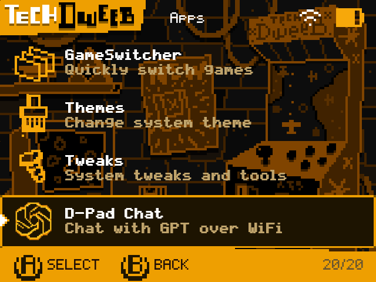

The tile, closer:

---

## A conversation

It opens to an empty prompt. The bar along the top carries the model and the connection
state; the one along the bottom is a reminder of the controls, and both stay put while the
conversation scrolls between them.

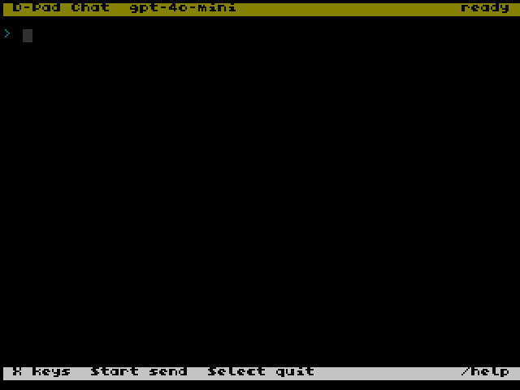

**X** raises the on-screen keyboard. It belongs to `st`, Onion's terminal, which is most of
the reason this app is a shell script at all — the keyboard came free.

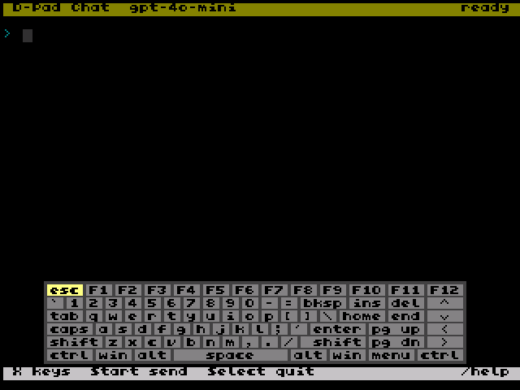

Move the cursor with the D-pad, press **A** for a key, **Start** to send.

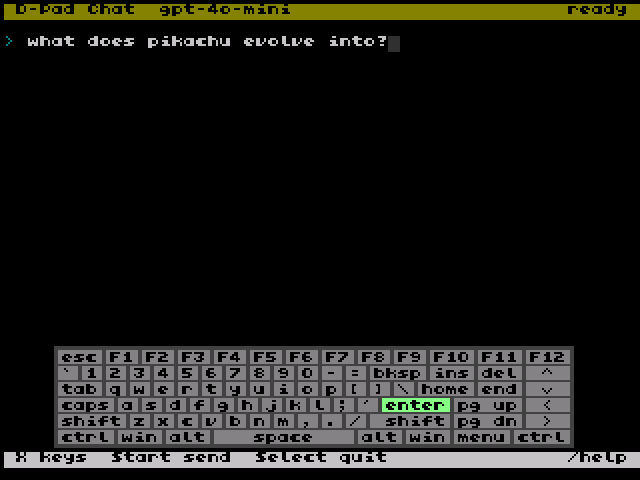

While the request is out, a marker counts the seconds. Without it the device simply looks
frozen, and the natural reaction to that is to press more buttons.

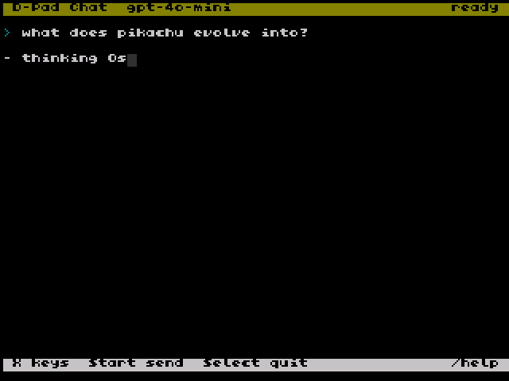

The reply streams in as it is generated, so text appears within a second or two rather
than all at once at the end. Press **X** to put the keyboard away and read.

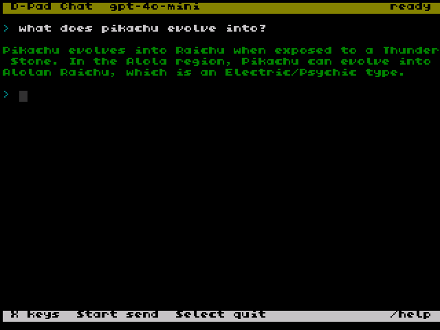

<!-- KNOWS WHAT YOU WERE PLAYING — the three captures for this feature
     (chat_prev_game_prefilled*.png) were taken against v0.13.0, which had a bug
     that left the prompt reading `I'm playing {game} -'*}Pokemon...` instead of
     substituting the name. Fixed since. Retake them and uncomment this.

## Knows what you were playing

Press **Menu** out of a game, open the app, and the prompt is already holding the game you
were in, greyed out. **Right** takes it, any other key takes it away.

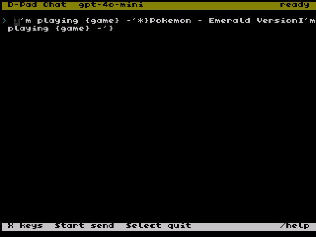

Carry on typing the part that is actually your question.

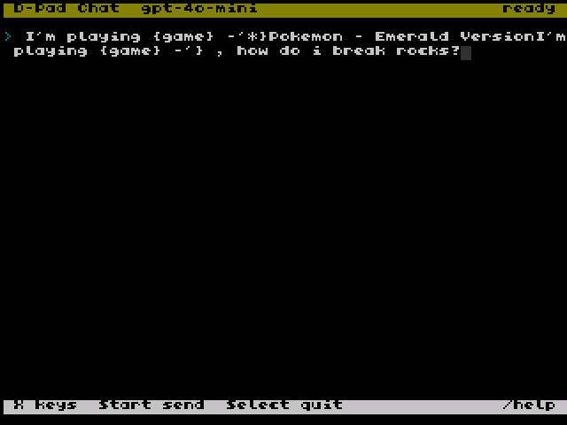

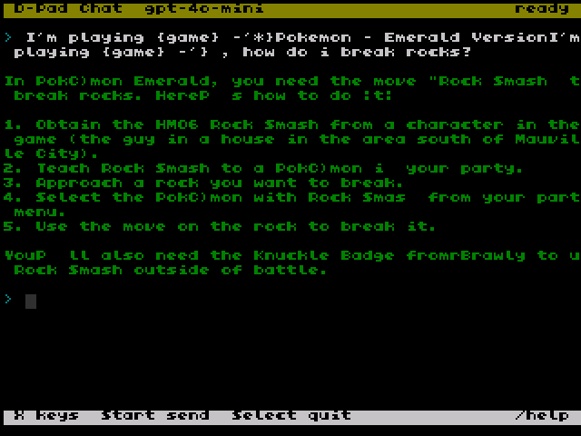

-->

---

## Coming back

Closing the app does not end the conversation. Reopening replays the most recent turns, so
the context the model still has is context you can see.

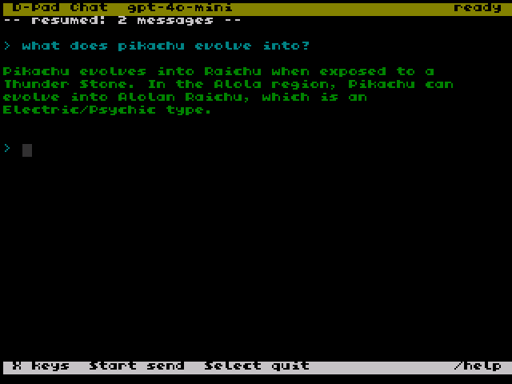

---

## Commands

Anything beginning with `/` is handled on the device and never sent to the model, so a
mistyped command does not turn into a question you pay for.

`/help` — the list, and a reminder of the keyboard toggle.

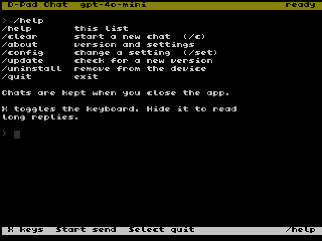

`/about` — the first screen to check when something is not working. Width and height are
what the terminal actually reports, the key is redacted, and `tls` and `net` are the two
that explain most failures.

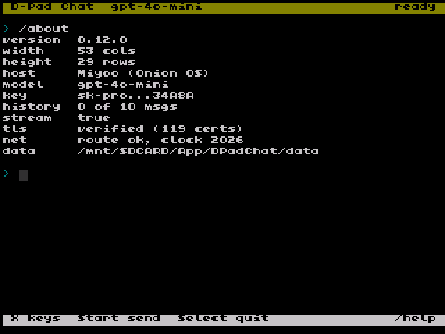

`/config` — the settings worth changing without a computer. `/config <name>` moves to the
next value, which matters when every character costs several button presses.

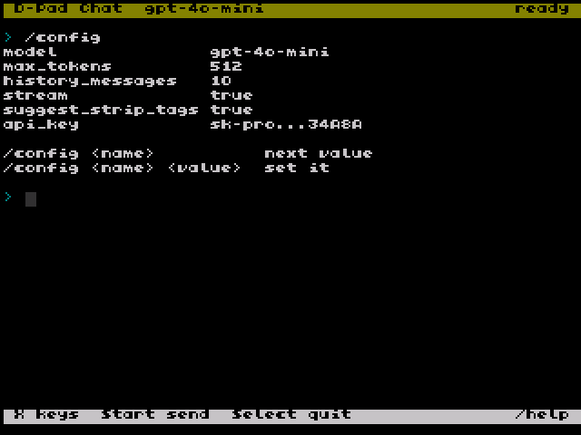

---

## Updating

`/update` asks GitHub for the latest release and shows you both versions. Nothing is
downloaded before you answer.

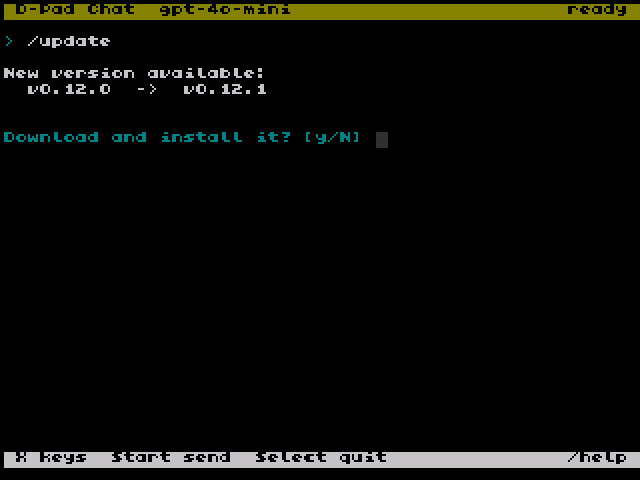

Answering yes unpacks the release beside the app and stops there. The swap happens on the
next launch, because a running script cannot safely be written over.

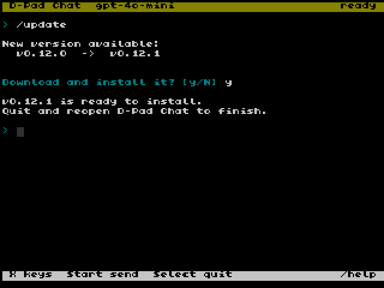

[techdweeb]: https://github.com/OnionUI/Themes/tree/main/themes/TechDweeb%20by%20TechDweeb
